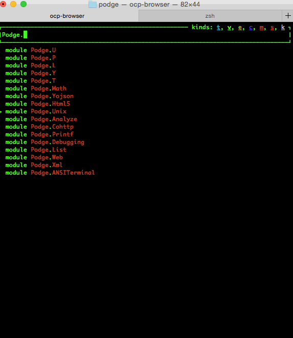

**Podge** is a centralization of helper functions and shortcuts that I
have frequently found myself writing over and over again in [OCaml](http://www.ocaml.org). It
doesn't depend on Jane Street's [Core](https://github.com/janestreet/core), [Batteries](https://github.com/ocaml-batteries-team/batteries-included) or even [Lwt](http://ocsigen.org/lwt/). Rather
Podge picks among various existing smaller packages that you probably
already have installed and provides helper functions for common tasks
related to usages of those libraries. Podge also provides some extra
modules like the Math module.

**Podge** is well suited for hackathons, especially when you just want
to do a quick HTTP get request for JSON data and subsequently play
with the JSON.

# Examples

These are all self-contained and tested to work.

## Requests

Program that does a `HTTP` get request for Bitcoin data via [Bitstamp's](https://www.bitstamp.net/api/)
public REST API.

```ocaml
(* This file is named show_query.ml *)
#require "podge"

let () =
  Podge.Web.get Sys.argv.(1)
  |> Podge.Y.Util.member "body"
  |> Podge.Y.Util.to_string
  |> Podge.Yojson.show_pretty_of_string
```

And you can run it from the command line with: 

```shell
$ utop show_query.ml https://www.bitstamp.net/api/ticker/
{
  "high": "266.44",
  "last": "261.47",
  "timestamp": "1439693570",
  "bid": "261.31",
  "vwap": "263.89",
  "volume": "6179.95060788",
  "low": "259.18",
  "ask": "261.47"
}
```

## Xml

Program for querying XML documents

```html
<!-- This file is named doc.html -->
<outer> Some innards
  <article> A Long article ... </article>
</outer>
```

Podge Code

```ocaml
(* This file is named show_node.ml *)
#require "podge"

let () = 
  Podge.Xml.query_node_of_file ["outer";"Article"] Sys.argv.(1)
  |> print_endline
```

Result

```shell
$ utop show_node.ml doc.html
 A Long article ...
```

# Overview of Modules

Everything is contained under one module, the `Podge` module. Modules
that contain helpers for existing OCaml packages will have the same
name as the package, for example `Podge.Yojson` contains functions for
working with the `yojson` package. While `Podge.Math` contains various
mathematical and statistical functions.

Probably the easiest way to learn what's provided by Podge is to look
at it via `ocp-browser`, provided by the [ocp-index](https://github.com/OCamlPro/ocp-index) package, have
`lambda-term` installed before you install `ocp-index` so that
`ocp-browser` is installed.



Hopefully the functions are named in such a way that you can infer the
semantics/intended usage.

# Yet another Standard Library Replacement?

No, this isn't yet another attempt at a standard library
replacement. Rather this is one place for me to put all code that I've
had scattered all around my hard-drive ranging from stuff that I've
written, to useful StackOverflow answers, to IRC chats, general
googling and Computer Science courses.

I focus on functionality, not new data structures or improvements of the
StdLib provided data structures, functions.

Perhaps there will be something of use in here as well for you. I
hope that some things here will help newcomers to the language as
well or at least help with quick Python like prototyping.
